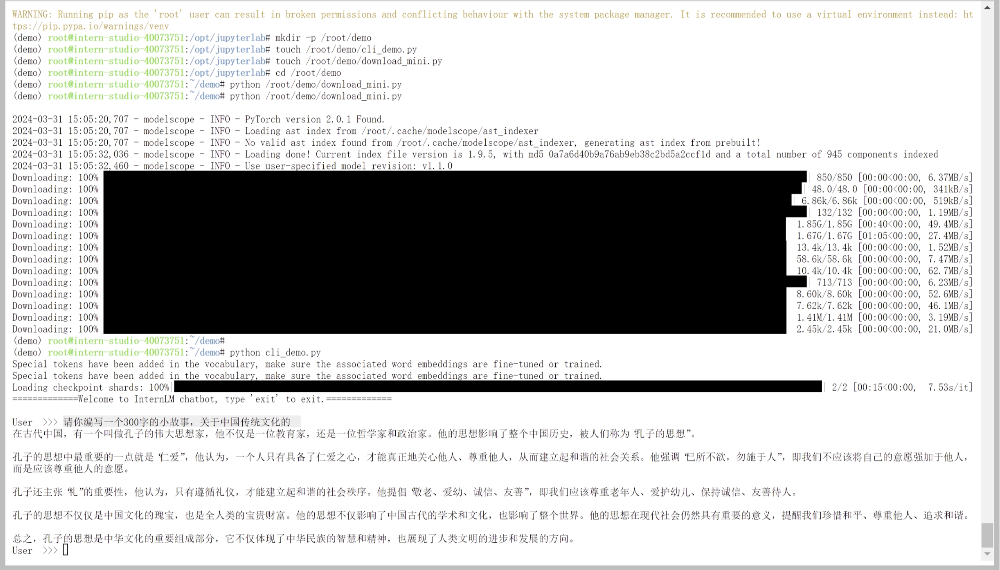

## 笔记
  
1. **InternLM2-Chat-1.8B模型的快速上手**  
  
   首先，我们搭建Intern Studio开发环境，利用Modelscope平台下载InternLM2-Chat-1.8B模型（其中B代表十亿参数）。Modelscope作为一个模型即服务平台，致力于集结AI领域的前沿机器学习模型，并为用户简化AI应用流程。  
  
2. **优秀案例展示：八戒-Chat-1.8B模型的Web Demo部署**  
  
   借助OpenXlab，我们成功部署了XiYou系列的八戒-Chat-1.8B模型，并完成了Web Demo的交互设置。  
  
3. **进阶操作：运行基于InternLM2-Chat-7B的Lagent智能体Demo**  
  
   在提升计算能力后，我们以InternLM2-Chat-7B模型为基础，运行了开源框架Lagent的智能体Demo。  
  
4. **高阶实践：灵笔InternLM-XComposer2的多模态创作**  
  
   通过InternLM-XComposer2模型，我们进行了浅唱多模态实践，实现了更为复杂的图文创作任务。
     
## 作业
- 